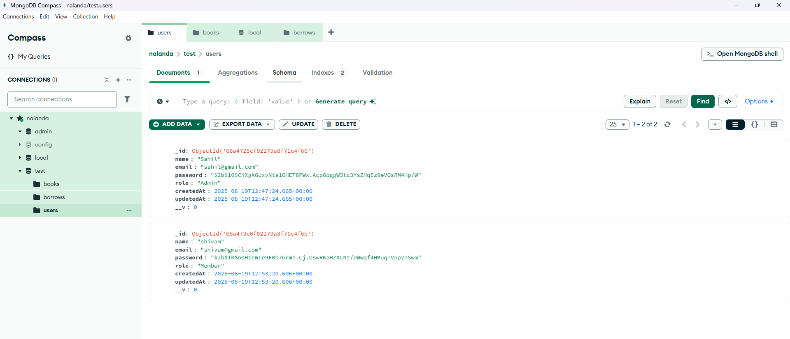
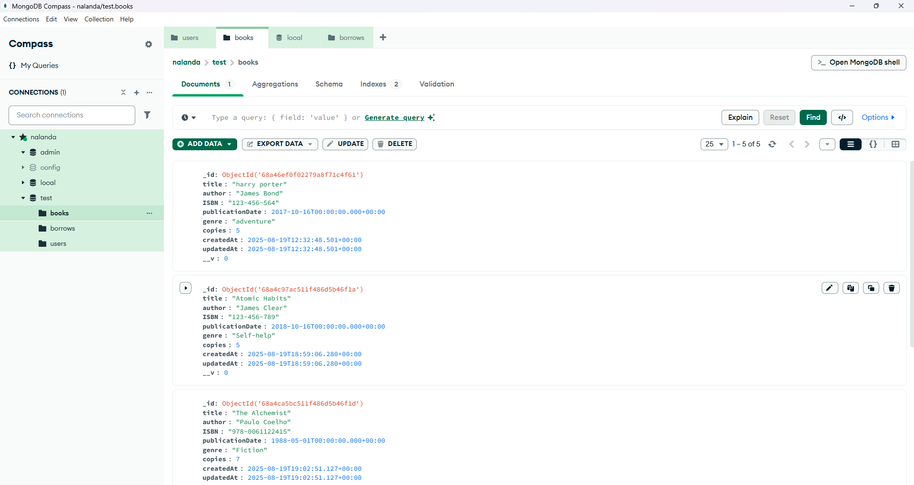
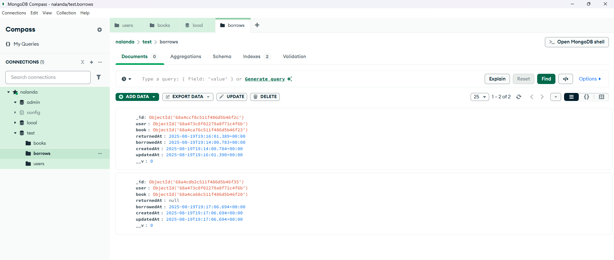

# 📚 Nalanda Library Management System

---

## 🔧 Features
- 👩‍🏫 **User Roles** – Admin, Librarian, and Student access levels  
- 📖 **Book Management** – Add, update, delete, and search books  
- 🧑‍💻 **User Management** – Manage library members and their profiles  
- 📅 **Borrow & Return** – Track issued books with due dates  
- 🔍 **Search & Filter** – Quickly find books by title, author, or category  
- 📊 **Reports** – Generate borrowing history and availability reports  

---

## 🛠️ Technologies Used
- ✅ **HTML5, CSS3, JavaScript** – Frontend structure and interactions  
- ✅ **Node.js + Express.js** – Backend server and API handling  
- ✅ **MongoDB** – Database for storing users & books  
- ✅ **Mongoose** – Database ORM for easy queries  
- ✅ **Git & GitHub** – Version control and collaboration
- ✅ **Postman** – API Endpoints  

---

## 📂 File Structure
```plaintext
nalanda-library-management-system/
├── server.js                 # Express server entry point
│── config                    # DB connection & environment setup
|   |──db.js
│── routes/                   # API routes (books, users, borrow)
|   |──authRoutes.js
|   |──bookRoutes.js
|   |──borrowRoutes.js
│── models/                   # Database schemas
|   |──Books.js
|   |──Borrow.js
|   |──User.js
│── controllers/              # Business logic for routes
|   |──authController.js
|   |──bookController.js
|   |──borrowController.js
│── utils/                    # JWT Tokens
|   |──jwt.js
│
├── .env                      # Example environment variables
├── package.json              # Dependencies and scripts
└── README.md                 # Project documentation (this file)
```
---

## ⚙️ Setup Instructions
### 1️⃣ Clone the repository
- git clone https://github.com/Sahil0p/Nalanda-Library-Management-System-Task.git
- cd Nalanda-Library-Management-System-Task

### 2️⃣ Install dependencies
- npm install
- cd Nalanda-Library-Management-System-Task

### 3️⃣ Configure environment variables
- Create a .env file in the root directory:
- `PORT=4000`
- `MONGO_URI=your_mongodb_connection_string`
- `JWT_SECRET=your_secret_key`
- `JWT_EXPIRES_IN=your_days`

### 4️⃣ Run the application
- npm run dev

---

## 🔑 Authentication & Role Usage
### Admin:
- Can add/update/delete books
- Can view all borrowed books and members

### Member:
- Can view books
- Can borrow/return books

### ⚠️ Important while testing in Postman:
- Use Bearer Token (Admin) when adding/updating/deleting books
- Use Bearer Token (Member) when borrowing/returning books
- Switch back to Admin Token to view borrowing statistics

---

## 📡 API Endpoints

### 🔑 Authentication
- `POST /api/register` → Register a new user
- `POST /api/login` → Login and receive JWT token

### 📚 Books
- `GET /api/books` → Get all books
- `GET /api/books/:id` → Get a single book
- `POST /api/books` → Add a book (Admin only)
- `PUT /api/books/:id` → Update book (Admin only)
- `DELETE /api/books/:id` → Delete book (Admin only)

### 📖 Borrow - Member Only
- Member Action - Use Bearer Token (Member)
- `POST /api/borrow/:bookId` → Borrow a book
- `GET /api/borrow/history` → View borrowing history
- `POST /api/borrow/return/:id` → Return a borrowed book

### 📖 Borrow - Admin Only
- Admin Action - Use Bearer Token (Admin)
- `GET /api/reports/most-borrowed` → Most borrowed book
- `GET /api/reports/active-members` → Number of active members
- `GET /api/reports/availability` → Number of books available

---

## 📬 Postman Collection

To make testing easier, we’ve created a Postman collection containing all API endpoints.

👉 **[Click here to open the Postman Collection](https://sahilahmed0029-3594081.postman.co/workspace/Sahil-Ahmed's-Workspace~507292b8-beec-4de7-81da-d9594af9042c/collection/47691689-d98af04f-7edb-4e5f-b670-ef4cebe83126?action=share&creator=47691689)**  

Or you can import it manually:  

1. Open **Postman**  
2. Click **Import**  
3. Paste the above link  
4. Start testing the APIs 🎉  

⚡ This collection includes:
- Authentication APIs of Admin & Members (Register, Login)
- Book Management APIs
- Borrow/Return APIs

---
## 📸 MongoDB Schema 
Below are the designed MongoDB schemas for **Users**, **Books**, and **Borrow Records**:

### 🧑 Users Schema


### 📚 Books Schema


### 📖 Borrow Records Schema

